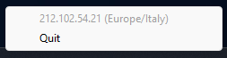

# Tarkov Server Checker

## Overview

Tarkov Server Checker is a small and lightweight tool that runs in the system tray, it retrieves and displays the most recent server's IP address and location from game's logs.

## Installation

Download the installation wizard from our [releases page](https://github.com/ssapp/tarkov-server-checker/releases) and follow the steps. After the installation process completes, just start the program. No further configuration needed.

## Contributions

Contributions are welcome! If you'd like to enhance the Tarkov Server Checker or report issues, please create a pull request or issue on the [GitHub repository](https://github.com/ssapp/tarkov-server-checker).

## License

This project is licensed under the MIT License. See the [LICENSE](./LICENSE) file for details.

## Disclaimer

Tarkov Server Checker is not affiliated with Escape from Tarkov or Battlestate Games. It is an independent utility created for informational purposes only.

---

If you find this tool helpful, don't forget to give it a star on GitHub!
